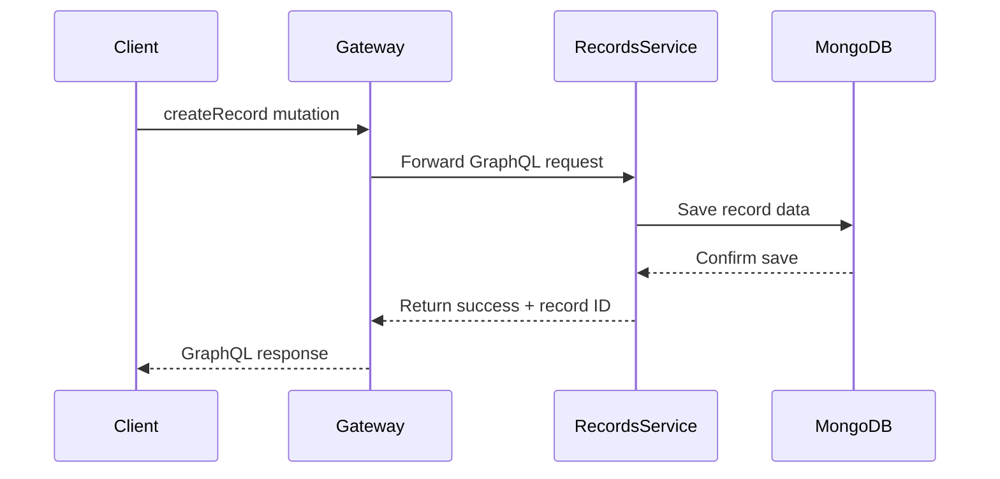
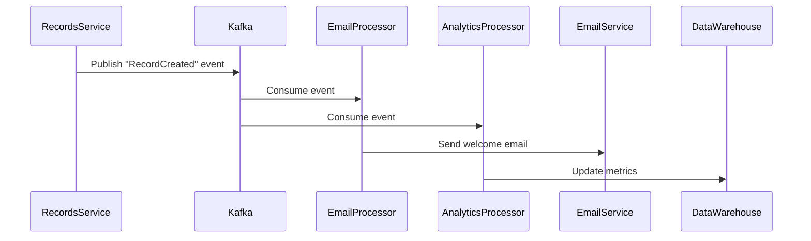

# 🚀 GraphQL Gateway Project

> *A blazing-fast, polyglot microservices ecosystem with unified GraphQL gateway and enterprise-grade database migrations*

[](https://www.typescriptlang.org/)
[](https://www.rust-lang.org/)
[](https://graphql.org/)
[](https://www.mongodb.com/)
[](https://www.docker.com/)
[](https://nodejs.org/)

## 🎯 Project Overview

Welcome to the **GraphQL Gateway Project** - a next-generation microservices platform that combines the power of unified GraphQL APIs with the flexibility of polyglot microservices. Built for scale, designed for developers, and engineered for production.

### ✨ Core Features

- **🌐 Unified GraphQL Gateway**: Single endpoint that aggregates multiple backend services seamlessly
- **🔥 Hot-Reloading**: Add new services during runtime without any service disruption
- **🎨 Schema Visualization**: Beautiful, interactive UI for exploring GraphQL schemas
- **💾 Persistent Storage**: Service metadata and schema information stored with reliability
- **🗃️ Advanced Migrations**: Enterprise-grade MongoDB migration system with CLI tools
- **🌍 Polyglot Architecture**: Services in TypeScript, Rust, Go, Python - all working together harmoniously

## 🏗️ Services Architecture

### 🌐 GraphQL Gateway (`packages/gateway/`)
- **🔧 Technology**: TypeScript, Node.js, Apollo Federation
- **🎯 Purpose**: Aggregates and proxies GraphQL schemas from multiple services
- **✨ Features**: Schema stitching, hot-reloading, error handling, rate limiting
- **🔗 Endpoints**: Unified GraphQL API with interactive playground

### 📦 Records Service (`packages/services/records/`)
- **🔧 Technology**: Rust, Axum, async-graphql, MongoDB
- **🎯 Purpose**: High-performance product catalog and record management
- **✨ Features**: CRUD operations, media handling, taxonomy support, migrations
- **⚡ Performance**: Blazing-fast queries with type safety guarantees

### 📚 Shared Libraries (`packages/shared/`)
- **🗃️ MongoDB Migrator**: Reusable migration framework for all services
- **🔄 Common Types**: Shared data structures and utilities
- **🛠️ Developer Tools**: CLI utilities and helper functions

## 🗃️ Database Migration System

> *Enterprise-grade database evolution with zero-downtime deployments*

### 🌟 Features
- ✅ **🔍 Auto-Discovery**: Migrations register themselves using inventory macros
- ✅ **🏠 Service Isolation**: Each service maintains its own migration state
- ✅ **🛠️ Rich CLI Tools**: Comprehensive command-line interface for migration management
- ✅ **↩️ Rollback Support**: Bidirectional migrations with proper error handling
- ✅ **🛡️ Type Safety**: Full Rust compile-time guarantees for data integrity
- ✅ **🚀 Production Ready**: Dry-run, planning, backup support, and zero-downtime deployments

### 🏃‍♂️ Quick Start
```bash
# 📊 Check migration status across all services
cargo run migrate status

# ⬆️ Apply all pending migrations
cargo run migrate up

# ⬇️ Rollback the last migration
cargo run migrate down

# 📋 Show detailed migration plan
cargo run migrate plan

# 🔍 Discover available migrations
cargo run migrate discover
```

### 📖 Documentation
- **[📚 MongoDB Migrator Framework](packages/shared/mongodb-migrator/README.md)** - Core migration system
- **[🗃️ Records Service Migration Guide](packages/services/records/MIGRATION_GUIDE.md)** - Service-specific guide  
- **[⚡ Migration Quick Reference](packages/services/records/MIGRATION_QUICK_REFERENCE.md)** - Command cheat sheet

## 🚀 Quick Start Guide

### 📋 Prerequisites

Before you begin, ensure you have:
- **Node.js 18+** - [Install Node.js](https://nodejs.org/)
- **Rust 1.70+** - [Install Rust](https://rustup.rs/)
- **MongoDB** - [Install MongoDB](https://docs.mongodb.com/manual/installation/) or use [MongoDB Atlas](https://www.mongodb.com/cloud/atlas)
- **Docker** (optional) - [Install Docker](https://docs.docker.com/get-docker/)

### 🏃‍♂️ Getting Started

1. **📥 Clone the Repository**
   ```bash
   git clone <repository-url>
   cd graphql-gateway
   ```

2. **⚙️ Environment Setup**
   ```bash
   # Copy environment templates
   cp packages/gateway/.env.example packages/gateway/.env
   cp packages/services/records/.env.example packages/services/records/.env
   ```

3. **🚀 Start the Gateway**
   ```bash
   cd packages/gateway
   npm install
   npm run dev
   ```

4. **🦀 Start the Records Service**
   ```bash
   cd packages/services/records
   cargo run
   ```

5. **🎉 Explore the APIs**
   - **Gateway Playground**: http://localhost:4000/graphql
   - **Records Service**: http://localhost:8080/graphql
   - **Health Checks**: Both services expose `/health` endpoints

### 🐳 Docker Deployment

```bash
# Build and start all services
docker-compose up --build

# Or start individual services
docker-compose up gateway records-service
```

## 💡 Future Improvements

> *Ideas and enhancements on our roadmap*

### 🔄 Schema Fallback Strategies
- **📦 Cached Strategy**: Return last known state when remote schema fetch fails
- **🗑️ Drop Strategy**: Remove failed endpoints from root schema (current default)
- **🔀 Graceful Degradation**: Partial schema loading with service health indicators

### 🌟 Planned Features  
- **🔐 Advanced Authentication**: OAuth2, JWT, API key management
- **📊 Real-time Analytics**: GraphQL query metrics and performance monitoring
- **🎯 Smart Caching**: Intelligent query result caching with TTL
- **🔍 Query Optimization**: Automatic query analysis and optimization suggestions

## 🏛️ Microservice Architecture Examples

> *Scalable, event-driven architecture that separates external API interactions from internal processing*

This section illustrates a production-ready system where the **GraphQL Gateway** serves as the primary API layer for external clients, while internal processing leverages an asynchronous, event-driven backbone using **Kafka**.

### 🎨 System Architecture

The diagram below showcases a modern architecture that decouples external API interactions from internal, event-based communication:

```
   🌐 External Clients (Web/Mobile/API)
                    │
                    ▼
          ┌───────────────────┐
          │ 🚀 GraphQL Gateway│
          │   (External API)  │
          └─────────▲─────────┘
                    │ (GraphQL Queries/Mutations)
         ┌──────────┴──────────┐
         │                     │
         ▼                     ▼
   ┌─────────────────┐   ┌──────────────────┐
   │ 📦 Records      │   │ 📂 Categories    │
   │    Service      │   │    Service       │
   │   (Rust)        │   │   (Go)           │
   └────────┬────────┘   └──────────┬───────┘
            │                       │
            ▼                       ▼
   ┌────────┴─────────┐   ┌─────────┴──────────┐
   │ 🍃 MongoDB       │   │ 🐘 PostgreSQL      │
   └──────────────────┘   └────────────────────┘
            │ (Events)              │
            └────────────┬──────────┘
                         │
                         ▼
               ┌──────────────────────────────────┐
               │ 🚀 Kafka / NATS (Event Bus)     │
               └─────────────────┬────────────────┘
                                 │ (Consume Events)
                                 ▼
               ┌──────────────────────────────────┐
               │ ⚡ Event Processor(s)            │
               │ (Analytics, Notifications, etc.) │
               │        (TypeScript/Java)         │
               └──────────────────────────────────┘
```

### 🏗️ System Layers

#### 1. 🌐 **API Gateway Layer (GraphQL Gateway)**
The Gateway serves as the **single source of truth** for all external clients. It provides:
- 🔄 **Unified GraphQL API** with schema stitching
- 🛡️ **Authentication & Authorization** 
- 🚦 **Rate limiting** and request throttling
- 📊 **Request routing** and load balancing
- 🔍 **API monitoring** and analytics

#### 2. ⚙️ **Service Layer (Polyglot Microservices)**
Each service is a **self-contained business unit** with clear responsibilities:

- **📦 Records Service (Rust)**
  - Core business logic for product record management
  - Optimized for performance and memory safety
  - MongoDB integration with advanced querying

- **📂 Categories Service (Go)**  
  - Manages data taxonomies and hierarchical categories
  - Built for high-concurrency read operations
  - PostgreSQL for relational data integrity

#### 3. 🚀 **Event-Driven Backbone (Kafka)**
**Asynchronous communication** for scalability and resilience:
- 📡 **Event Publishing**: Services emit domain events
- 🔄 **Loose Coupling**: Services evolve independently  
- 📈 **Horizontal Scaling**: Process events in parallel
- 🛡️ **Fault Tolerance**: Retry mechanisms and dead letter queues

#### 4. ⚡ **Event Processing Layer**
**Specialized background services** for non-blocking operations:
- 📧 **Notification Service**: Email, SMS, push notifications
- 📊 **Analytics Pipeline**: Data aggregation and insights
- 🔍 **Search Indexing**: ElasticSearch synchronization
- 🗄️ **Data Warehousing**: ETL processes for business intelligence

### 🔄 Request & Data Flow Examples

#### **Synchronous Flow (External API)**


**Perfect for**: User-facing interactions requiring immediate feedback

#### **Asynchronous Flow (Internal Processing)**


**Perfect for**: Background tasks, analytics, notifications, and data processing

### 🛠️ Development Workflow

### 🚀 Local Development Setup

```bash
# 📦 Install dependencies for all services
npm run bootstrap  # or manually install each service

# 🔄 Start development mode with hot-reload
npm run dev:all

# 🧪 Run tests across all services  
npm run test:all

# 🎨 Format code consistently
npm run format:all

# 🔍 Lint and check code quality
npm run lint:all
```

### 🧪 Testing Strategy

```bash
# Gateway tests (TypeScript)
cd packages/gateway
npm test
npm run test:integration

# Records service tests (Rust)
cd packages/services/records  
cargo test
cargo test --release  # Performance tests

# End-to-end tests
npm run test:e2e
```

### 📊 Code Quality & Standards

- **TypeScript**: ESLint + Prettier for consistent code style
- **Rust**: rustfmt + clippy for idiomatic Rust code  
- **GraphQL**: Schema validation and breaking change detection
- **Git Hooks**: Pre-commit hooks for automated quality checks

## 📈 Monitoring & Observability

### 🔍 Health Monitoring

Each service exposes comprehensive health endpoints:

```bash
# Gateway health
curl http://localhost:4000/health

# Records service health  
curl http://localhost:8080/health

# Detailed health with dependencies
curl http://localhost:4000/health/detailed
```

### 📊 Metrics & Analytics

- **GraphQL Metrics**: Query performance, error rates, schema usage
- **Service Metrics**: Request latency, throughput, error rates
- **Database Metrics**: Connection pools, query performance
- **Migration Metrics**: Success rates, execution times

### 🚨 Alerting & Logging

```typescript
// Structured logging example
logger.info('Record created', {
  recordId: record.id,
  userId: context.user.id,
  duration: '23ms',
  metadata: { source: 'api' }
});
```

## 🤝 Contributing

We welcome contributions! Here's how to get involved:

### 🎯 Getting Started

1. **🍴 Fork the repository**
2. **🌟 Create a feature branch**: `git checkout -b feature/amazing-feature`
3. **✨ Make your changes**: Follow our coding standards
4. **🧪 Add tests**: Ensure your changes are well tested
5. **📝 Update docs**: Keep documentation current
6. **✅ Commit changes**: `git commit -m 'feat: add amazing feature'`
7. **🚀 Push to branch**: `git push origin feature/amazing-feature`
8. **📬 Open Pull Request**: Describe your changes thoroughly

### 📋 Development Guidelines

#### **For Gateway (TypeScript)**
- Follow existing code patterns and architecture
- Write comprehensive tests for new features
- Update GraphQL schema documentation
- Ensure backward compatibility

#### **For Services (Rust)**
- Use `cargo fmt` and `cargo clippy`
- Write unit and integration tests
- Add database migrations when needed
- Document public APIs thoroughly

#### **For Documentation**
- Keep README files up-to-date
- Add inline code comments for complex logic
- Include examples for new features
- Update architecture diagrams when relevant

### 🎯 Contribution Areas

- 🐛 **Bug Fixes**: Help us squash bugs and improve stability
- ✨ **New Features**: Add exciting new capabilities
- 📚 **Documentation**: Improve guides and examples
- 🧪 **Testing**: Expand test coverage and scenarios
- 🎨 **UI/UX**: Enhance GraphQL playground and tools
- ⚡ **Performance**: Optimize queries and service performance

## 📚 Resources & Learning

### 📖 Documentation

- **[GraphQL Official Docs](https://graphql.org/learn/)** - Learn GraphQL fundamentals
- **[Rust Book](https://doc.rust-lang.org/book/)** - Master Rust programming
- **[MongoDB Docs](https://docs.mongodb.com/)** - Database best practices
- **[Apollo Federation](https://www.apollographql.com/docs/federation/)** - Advanced GraphQL patterns

### 🎓 Tutorials & Guides

- **[Microservices with GraphQL](https://graphql-microservices.com/)** - Architecture patterns
- **[Event-Driven Architecture](https://microservices.io/patterns/data/event-driven-architecture.html)** - Design principles
- **[Rust for JavaScript Developers](https://github.com/yoshuawuyts/rust-for-js-devs)** - Language transition guide

### 🛠️ Tools & Extensions

- **[GraphQL Playground](https://github.com/graphql/graphql-playground)** - Interactive API explorer
- **[VS Code GraphQL Extension](https://marketplace.visualstudio.com/items?itemName=GraphQL.vscode-graphql)** - Enhanced development experience
- **[Rust Analyzer](https://rust-analyzer.github.io/)** - Rust language server
- **[MongoDB Compass](https://www.mongodb.com/products/compass)** - Database GUI

## 📄 License

This project is licensed under the **MIT License** - see the [LICENSE](LICENSE) file for details.

---

<div align="center">

**🚀 Built with passion by the GraphQL Gateway Team**

*Scalable • Performant • Developer-Friendly*

[](https://github.com/your-org/graphql-gateway)
[](https://twitter.com/your-org)

</div>
